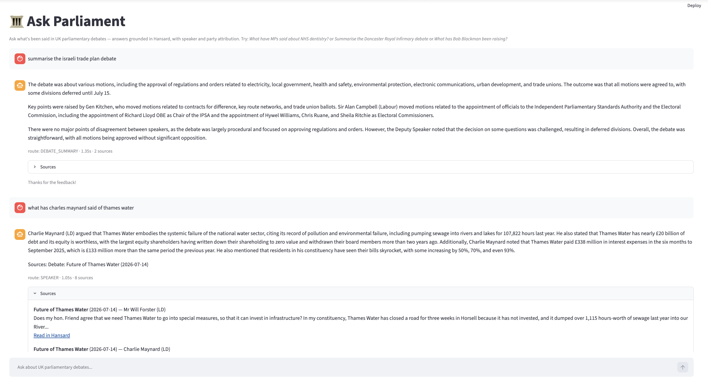
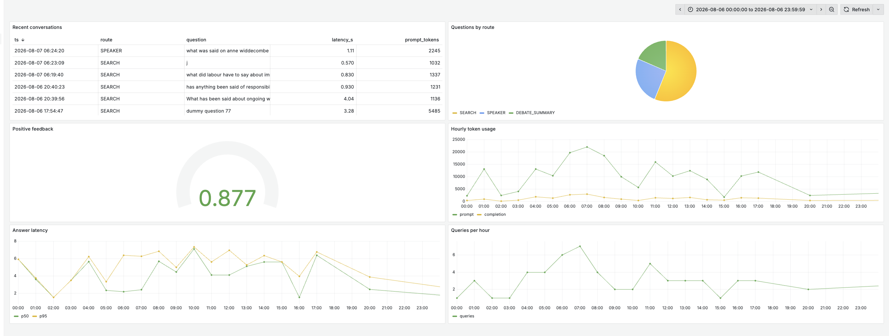

# Ask Parliament — RAG over UK Hansard debates

Ask what's been said in UK parliamentary debates, in plain English, with answers
grounded in Hansard and attributed to the MPs who said it.

**"What have MPs said about NHS dentistry?" · "Summarise the Doncaster Royal
Infirmary debate" · "What has Bob Blackman been raising in parliament?"**




## Problem

Hansard publishes everything said in parliament, but it's thousands of pages of
procedural, rambling, multi-topic speech — unsearchable in practice for someone
who just wants "what's being done about X?". Ask Parliament ingests recent
Commons debates, indexes them for hybrid search, and answers natural-language
questions with speaker/party attribution and links back to the official record.

## How it works

Hansard API ──> ingest (fetch, clean, chunk) ──> Elasticsearch (BM25 + dense vectors)
│
User ──> Streamlit ──> LLM router ──> SEARCH | DEBATE_SUMMARY | SPEAKER
│                          │
└──> attributed answer + Hansard citations
│
Postgres (conversations, feedback) ──> Grafana

- **Data**: Hansard API, Commons debates 2026-07-08 → 2026-07-16
- **Chunking**: contributions split on paragraph boundaries and grouped to
  ~350 tokens, each chunk prefixed with its debate title before embedding —
  long speeches cover many unrelated topics, so whole-contribution embedding
  produces muddy vectors (measured below)
- **Search**: Elasticsearch 8.17 — keyword (BM25), vector (kNN with
  `multi-qa-MiniLM-L6-cos-v1`), and hybrid via Reciprocal Rank Fusion
- **Agentic routing**: one cheap LLM call classifies each question and picks a
  tool. Debate summaries deliberately bypass top-k retrieval — the whole debate
  is fetched in speaking order, because similarity search is the wrong mechanic
  for "summarise this debate"
- **LLMs**: Groq — `llama-3.3-70b-versatile` answers; `llama-3.1-8b-instant`
  routes and judges, keeping per-model rate budgets separate
- **Monitoring**: every conversation logged to Postgres (route, latency,
  tokens, thumbs up/down); Grafana dashboard with 6 panels

## Evaluation

**Retrieval** — ground truth is 5 LLM-generated questions per chunk over ~200
sampled chunks, prompted to paraphrase rather than copy (so keyword search gets
no free ride). Relevance judged at contribution level, k=5:

| approach | hit rate | MRR |
|---|---|---|
| keyword (BM25) | 0.561 | 0.406
| vector (kNN) | 0.487 | 0.346
| **hybrid (RRF)** | **0.608** | **0.434**

**Chunking strategies** — same ground truth, contribution-level relevance:

| chunking | hit rate | MRR |
|---|---|---|
| whole contribution | 0.579 | 0.403 |
| **paragraph (~350 tok)** | **0.608** | **0.434** |


Paragraph chunking won, confirming the design hunch: adjournment-style speeches
covering 12+ topics embed to unusable averages as single chunks.

**LLM (answer quality)** — two prompt variants over 50 questions, judged
RELEVANT / PARTLY_RELEVANT / NON_RELEVANT by a different model
(`llama-3.1-8b-instant`) from the answerer:

| variant | relevant | partly | non |
|---|---|---|---|
| v1 plain | X.XX | X.XX | X.XX |
| **v2 attributed** | **X.XX** | **X.XX** | **X.XX** |

V2 (attribution + sources required) is what the app ships with.

## Running it

Prereqs: Docker, a free [Groq API key](https://console.groq.com), Python 3.12+.

```bash
git clone <REPO_URL> && cd hansard-rag
echo "GROQ_API_KEY=gsk_..." > .env
docker compose up -d --build     # ES + Postgres + Grafana + app (first build slow: torch)
```

Set up the notebook environment and populate the index:

```bash
pip install -r requirements.txt          # or: uv pip install -r requirements.txt
# processed chunks are committed, so you can go straight to indexing:
jupyter notebook 2.index.ipynb           # run top to bottom (~2-3 min)
# or rebuild the corpus from the Hansard API first: 1.ingest.ipynb (~5 min)
```

Open **http://localhost:8501** and ask away. Each answer shows its route,
latency, sources with Hansard links, and feedback buttons.

**Monitoring**: http://localhost:3000 (admin/admin) → add a PostgreSQL
datasource (host `postgres:5432`, db/user/password `hansard`, TLS disable) →
Dashboards → Import → `grafana/dashboard.json`. To see the dashboard with
sample data before generating real traffic:

```bash
docker exec -i hansard-postgres psql -U hansard -d hansard < scripts/seed_dummy.sql
# and to remove it: scripts/clear_dummy.sql
```



## Repo guide

| path | what |
|---|---|
| `1.ingest.ipynb` | fetch debates from the Hansard API, clean, chunk (two strategies) |
| `2.index.ipynb` | embed + index into Elasticsearch, smoke tests |
| `3.eval_retrieval.ipynb` | ground truth generation + retrieval evaluation |
| `4.rag.ipynb` | RAG tools, agentic router, LLM-as-judge evaluation |
| `shared_funcs/search.py` | search layer used by the notebooks (kept in sync with `app/hansard_rag/search.py`) |
| `app/` | Streamlit app + `hansard_rag` package (search, rag, db) |
| `docker-compose.yaml` | Elasticsearch, Postgres, Grafana, app |
| `data/processed/` | chunks, ground truth, eval results (committed so reviewers can skip ingestion) |
| `grafana/dashboard.json` | importable monitoring dashboard |
| `scripts/` | dashboard demo data seed + cleanup |

## Limitations & next steps

- Corpus is one sitting week; scaling to a full session is a date-range change
- Very long debates are truncated before summarisation (map-reduce is the upgrade)
- Judge and answerer are different sizes but the same model family; an
  independent judge would strengthen the LLM eval
- Speech→vote joins via the Commons Votes API would answer "did MPs vote the
  way they spoke?" — the feature I most want to build next